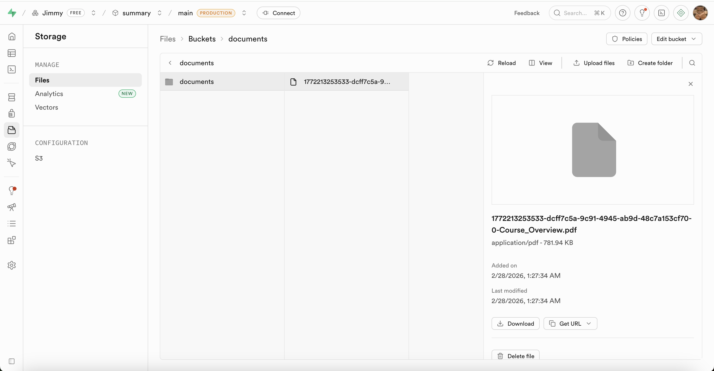
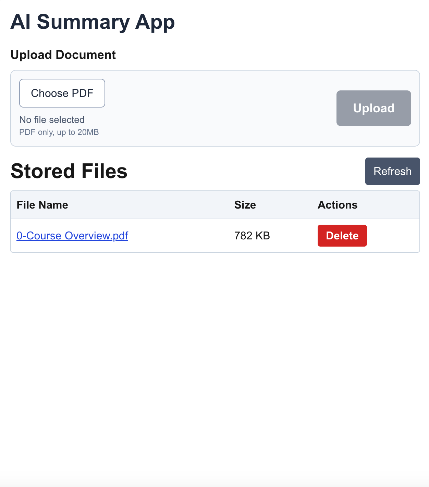
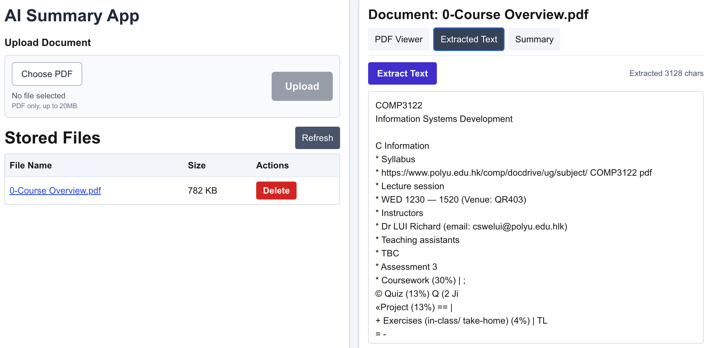
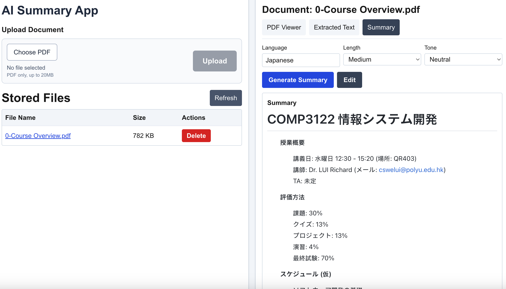
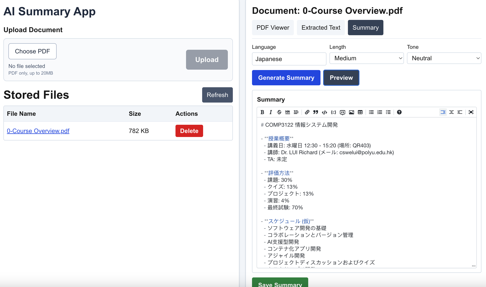
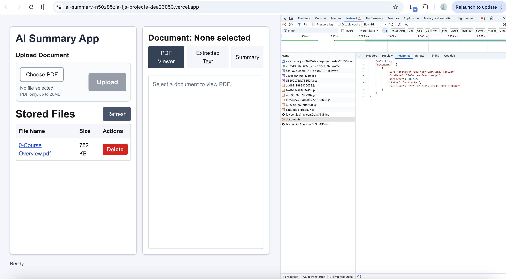

## Section 6: Supabase Object Store
Supabase is an open-source Firebase alternative that provides developers with a complete backend-as-a-service platform centered around PostgreSQL, a powerful relational database system offering full SQL capabilities, real-time subscriptions, and robust extensions for scalable data management. Its object storage is an S3-compatible service designed for storing and serving files like images, videos, and user-generated content.

Website: https://supabase.com/

**Requirements**:
- Build a document upload and file management system powered by Supabase. The backend will include API endpoints to interact with Supabse.
- **Note:** The detailed requirement will be discussed in week 4 lecture.
- Make regular commits to the repository and push the update to Github.
- Capture and paste the screenshots of your steps during development and how you test the app. Show a screenshot of the documents stored in your Supabase Object Database.

Test the app in your local development environment, then deploy the app to Vercel and ensure all functionality works as expected in the deployed environment.

**Steps with major screenshots:**

1. Set up Supabase project and created a storage bucket for PDF files.
2. Connected the app backend APIs to Supabase Storage for upload, list, and delete.
3. Tested upload and document listing locally.
4. Deployed to Vercel and verified file management works in production.

## Supabase Storage bucket page showing uploaded PDF objects

## App page showing uploaded files in the Stored Files table

## Section 7: AI Summary for documents
**Requirements:**  
- **Note:** The detailed requirement will be discussed in week 4 lecture.
- Make regular commits to the repository and push the update to Github.
- Capture and paste the screenshots of your steps during development and how you test the app.
- The app should be mobile-friendly and have a responsive design.
- **Important:** You should securely handlle your API keys when pushing your code to GitHub and deploying your app to the production.
- When testing your app, try to explore some tricky and edge test cases that AI may miss. AI can help generate basic test cases, but it's the human expertise to  to think of the edge and tricky test cases that AI cannot be replace. 

Test the app in your local development environment, then deploy the app to Vercel and ensure all functionality works as expected in the deployed environment. 

**Steps with major screenshots:**

1. Implemented OCR-based text extraction from uploaded PDF files.
2. Added AI summary generation with configurable language, length, and tone.
3. Secured API keys in environment variables (local + Vercel), not hardcoded in source.
4. Improved Summary UX with single-block preview/edit mode and markdown editor toolbar.
5. Ran tests for routes and unit logic, including error and edge scenarios.

## Extracted Text tab showing OCR output from a PDF

## Summary tab showing language/length/tone options and generated summary.

## Summary edit mode with markdown toolbar

## Section 8: Database Integration with Supabase  
**Requirements:**  
- Enhance the app to integrate with the Postgres database in Supabase to store the information about the documents and the AI generated summary.
- Make regular commits to the repository and push the update to Github.
- Capture and paste the screenshots of your steps during development and how you test the app.. Show a screenshot of the data stored in your Supabase Postgres Database.

Test the app in your local development environment, then deploy the app to Vercel and ensure all functionality works as expected in the deployed environment.

**Steps with major screenshots:**

1. Created/used Supabase Postgres tables to store document metadata and summary versions.
2. Connected backend service functions to read/write document and summary records.
3. Verified end-to-end flow: upload document → extract text → generate summary → save summary.
4. Validated saved records in Supabase Table Editor and from app reload behavior.

## App UI showing persisted summary after refresh/reopen

## Section 9: Additional Features [OPTIONAL]
Implement at least one additional features that you think is useful that can better differentiate your app from others. Describe the feature that you have implemented and provide a screenshot of your app with the new feature.

> [Description of your additional features with screenshot goes here]
> Implemented a single-panel Summary workspace with Preview/Edit toggle and markdown toolbar.
> This improves usability by allowing quick edits (bold, italic, headings, lists) without switching between separate blocks.
>
